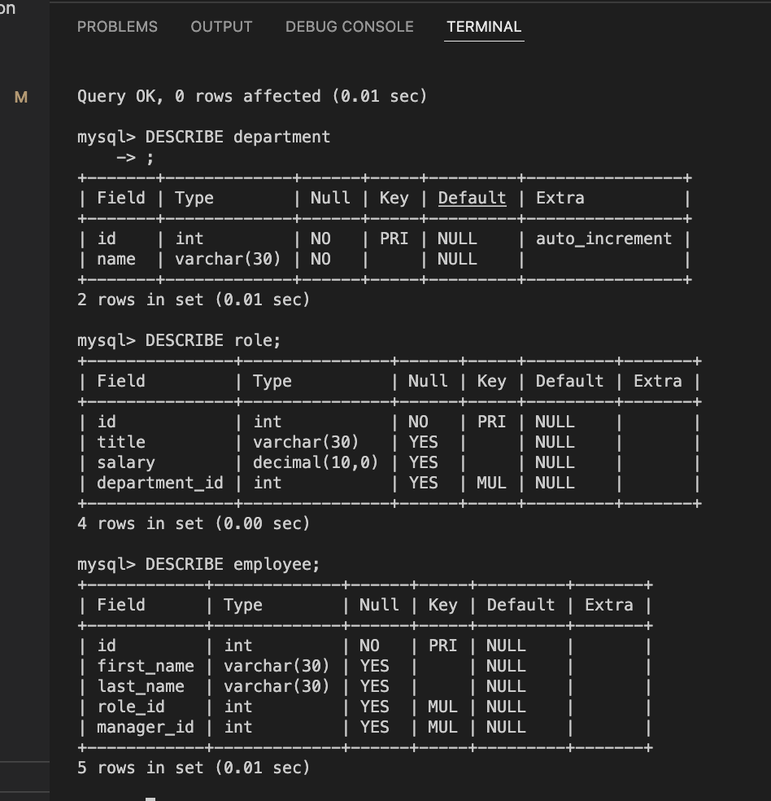
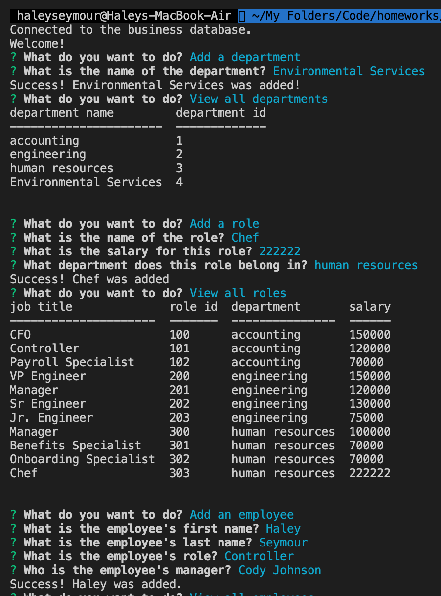
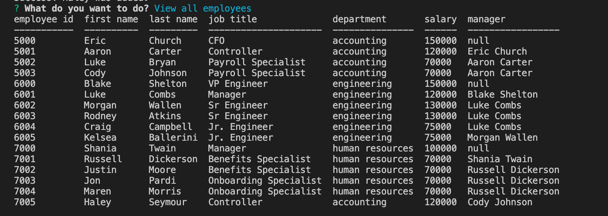
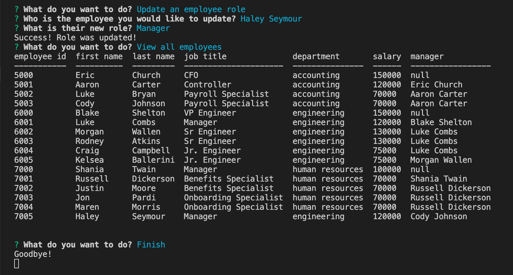

# **Employee Tracker**

## Table of Contents
---
* [License](#license)
* [Installation](#installation)
* [Packages](#packages)
* [Description](#description)
* [Usage](#usage)
* [Contributing](#contributing)
* [Questions](#questions)

 

## License 
---
[MIT License](./LICENSE)  

Copyright (c) 2022 Haley Seymour

Permission is hereby granted, free of charge, to any person obtaining a copy
of this software and associated documentation files (the "Software"), to deal
in the Software without restriction, including without limitation the rights
to use, copy, modify, merge, publish, distribute, sublicense, and/or sell
copies of the Software, and to permit persons to whom the Software is
furnished to do so, subject to the following conditions:

The above copyright notice and this permission notice shall be included in all
copies or substantial portions of the Software.

THE SOFTWARE IS PROVIDED "AS IS", WITHOUT WARRANTY OF ANY KIND, EXPRESS OR
IMPLIED, INCLUDING BUT NOT LIMITED TO THE WARRANTIES OF MERCHANTABILITY,
FITNESS FOR A PARTICULAR PURPOSE AND NONINFRINGEMENT. IN NO EVENT SHALL THE
AUTHORS OR COPYRIGHT HOLDERS BE LIABLE FOR ANY CLAIM, DAMAGES OR OTHER
LIABILITY, WHETHER IN AN ACTION OF CONTRACT, TORT OR OTHERWISE, ARISING FROM,
OUT OF OR IN CONNECTION WITH THE SOFTWARE OR THE USE OR OTHER DEALINGS IN THE
SOFTWARE.
  

 

## Installation
---
To install this project: 
1. Start by forking this repository on Github. 
2. Clone this project to your machine by using the "git clone + URL" command. 
3. Open the project with your favorite text editor, like VS Code (in your terminal, first type "cd foldername" then "code ."). 
4. Install Node.js from their website, if you have not already. Here are some additional [instructions](https://coding-boot-camp.github.io/full-stack/nodejs/how-to-install-nodejs).
5. Install MySQL from their website, if you have not already. Here are some additional [instructions](https://coding-boot-camp.github.io/full-stack/mysql/mysql-installation-guide).
5. This project includes a package.json file that specifies dependencies for this project, so be sure to run "npm install" in your terminal. This will install the packages specified in the next section. 

 

## Packages
---
General Technologies: 
- Javascript
- Node.js
- Git
 

NPM Packages:
- Inquirer
- mySql2
- Console.table

 

## Description
---
This purpose of this project is to create a database for a business owner to track their employee's information. Information is stored using MySql in a database titled business_db. This database contains three tables: department, role, and employee. The department table contains the department id and name. The role table includes the role id, title, salary, and associated department id. The employee table includes the employee id, first name, last name, associated role id, and associated manager's id. This project is a command line application that allows the user to view, add, and update data from this database. It aims to assist the business in neatly managing this information for quick and easy use.   
This project is not deployed.   

## Usage 
---
This program is a command-line application with Node.js. To use this program:  
1. Open the database files in your terminal. 
2. Run command "mysql -uroot -p" and enter your password (note: keystrokes will not show).
3. Run command "SOURCE schema.sql" to set up the database and tables.
4. OPTIONAL - run command "SOURCE seeds.sql" if you would like to seed the table with starter data.
5. Open the "index.js" file in your integrated terminal.
6. Run the command "node index.js" and a series of prompts will begin. 
7. Run through the prompts as desired. Each will return you to the menu when completed.
8. When you are finished, select the "finish" option from the menu. Optionally, run "control+C" to abort if desired. 

  

Please check out this [video](https://drive.google.com/file/d/1WDaEEP6GeagTGqogS1rasjnl5GI0MjLi/view) to view a demonstration of this command-line application in action.

 

### **Screenshots**
--- 
Table Descriptions  

 
Prompt Examples  

 

 

 

## Contributing 
---
This project was completed by myself, Haley Seymour. Please contribute as you wish and contact me with questions. 

 

## Questions?
---
Please contact me on Github at [hseymo](https://github.com/hseymo) or by [email](mailto:haleycseymour@comcast.net).